# 北海365分类信息系统 — 全项目数据库 ER 图

创建时间：2026-04-15

> 覆盖项目实施范围（注册 → 购套餐 → 发布 → 审核 → 上线 → 浏览联系 → 评论）内的全部核心表与关联关系。
> 数据源：`service-api/app/models/*.py`、`docs/modules/*/02-db-mapping.md`、`beihai365_qianfan.sql`。
>
> 说明：数据库表共 400+，本图仅收录当前项目业务流涉及的表。超出范围（直播、AI、红包、圈子、交友、CRM 等）的表不在此列。

## 一、全局 ER 图（Mermaid）

```mermaid
erDiagram

    %% ========== 用户域 ==========
    s_user {
        int id PK "用户ID"
        char username "用户名"
        varchar nickname "昵称"
        varchar phone "手机号"
        char password "密码"
        char icon "头像"
        smallint is_delete "0正常 1已删"
        tinyint is_secrecy "是否保密"
        int created_at
    }
    common_user {
        int uid PK,FK "关联 s_user.id"
        tinyint status "账号状态"
        int last_login_at
    }
    s_user_login {
        int id PK
        int user_id FK
        varchar device
        varchar ip
        int login_at
    }
    s_forbid {
        int id PK
        int user_id FK
        tinyint type "封禁类型"
        int expire_at
        varchar reason
    }
    s_bindmobile_record {
        int id PK
        int uid FK
        varchar phone
        int created_at
    }

    %% ========== 用户组 / 身份域 ==========
    s_group {
        int id PK
        varchar name "组名"
        tinyint auth "是否需认证"
        tinyint skip_verify "是否免审"
        int expire "有效期(天)"
        tinyint is_show
    }
    s_group_user {
        int user_id PK,FK
        int group_id PK,FK
        tinyint status "0待审 1通过 2拒绝 3退款"
        int expire_at
        int record_id
    }

    %% ========== 分类 / 主题 / 字段 域 ==========
    s_fenlei_category {
        int id PK
        int parent_id FK "自关联"
        int theme_id FK
        varchar name
        mediumint child_num
        smallint status
        mediumint sort
        varchar logo
        varchar share_title
        varchar share_desc
        varchar share_image
        tinyint is_rule_enable
        text rule_content
    }
    s_fenlei_theme {
        int id PK
        mediumint template
        varchar name
    }
    s_fenlei_category_setting {
        int category_id PK,FK
        int theme_id FK
        smallint need_check
        text publish_notice
        smallint allow_done
        varchar contacts
    }
    s_fenlei_category_perm {
        int id PK
        int category_id FK
        int group_id FK "0=个人"
        text group_ids
        smallint publish_payment "1免费 2现金 3金币"
        decimal publish_cost
        mediumint period
        smallint allow_top
    }
    s_fenlei_field {
        int id PK
        int theme_id FK
        int category_id FK
        varchar name
        varchar alias
        varchar type
        smallint require
        smallint is_system
        smallint is_hidden
        smallint is_filter
        text choices
        mediumint sort
        smallint status
    }
    s_fenlei_audit_reason {
        int id PK
        varchar name "审核理由"
        tinyint type "1拒绝 2下架"
        smallint status
    }

    %% ========== 信息主数据域 ==========
    s_fenlei_info {
        int id PK
        int category_id FK
        int user_id FK
        int group_id FK
        smallint theme_template
        varchar title
        mediumtext content
        varchar cover
        varchar color
        varchar sph_set
        smallint top
        int top_expire
        tinyint status "1通过 2待审 3下架 4拒绝 5已删除"
        smallint is_pay "1已付 2未付"
        tinyint done "是否成交"
        tinyint source "渠道来源"
        int order_id
        int package_log
        int views
        int contact_num
        int expire_at
        int refresh_at
        int pass_at
        int created_at
        int updated_at
    }
    s_fenlei_info_var {
        int id PK
        int info_id FK
        int category_id FK
        int field_id FK
        varchar alias
        varchar field_type
        text value
        text images
        int min_value
        int max_value
        double lng
        double lat
    }
    s_attach {
        int id PK
        int user_id FK
        tinyint belong_type "0通用 1本地圈"
        int belong_id "关联业务ID"
        char path "七牛路径"
        tinyint host "0本地 1七牛 2又拍"
        int width
        int height
        int created_at
    }

    %% ========== 发布 / 套餐 / 流水域 ==========
    s_fenlei_publish_log {
        int id PK
        int info_id FK "唯一"
        int user_id FK
        int category_id FK
        tinyint type "1免费 2套餐 3付费"
        bigint publish_time
    }
    s_fenlei_package {
        int id PK
        varchar name
        int category_id FK
        text category_ids
        decimal price
        int expire_days
        int post_num
        int fresh_num
        int top_days
        int index_top_days
        tinyint is_edit
        tinyint is_deleted
    }
    s_fenlei_package_user {
        int id PK
        int uid FK
        int package_id FK
        int post_num "剩余发布次数"
        int fresh_num "剩余刷新次数"
        int top_days "剩余置顶天数"
        tinyint on_use
        int expired_at
        int order_id
    }
    s_fenlei_package_log {
        int id PK
        int uid FK
        int user_package_id FK
        int info_id FK
        varchar content "扣减内容JSON"
        int created_at
    }
    s_fenlei_user_log {
        int id PK
        int user_id FK
        int info_id FK
        int category_id FK
        int group_id FK
        int order_id
        decimal pay_cash
        decimal pay_virtual
        decimal pay_gold
        tinyint style "1置顶..5发布..9退款"
        tinyint source "1APP 2后台 3导入 4WAP 5小程序"
    }

    %% ========== 评论域 ==========
    s_fenlei_comment {
        int id PK
        int pid FK "父评论"
        int info_id FK
        int uid FK "评论人"
        int to_uid FK "被回复人"
        text content
        tinyint status "0待审 1通过 2拒绝"
        int admin_id FK
        int created_at
        int updated_at
    }

    %% ========== 收藏 / 举报 / 历史域 ==========
    s_fenlei_collect_user {
        int id PK
        int user_id FK
        int info_id FK
        int created_at
    }
    s_fenlei_history {
        int id PK
        int user_id FK
        int info_id FK
        int updated_at
    }
    s_fenlei_call_log {
        int id PK
        int info_id FK
        int user_id FK "查看者"
        int created_at
    }
    s_fenlei_subscribe {
        int id PK
        int user_id FK
        int category_id FK
        varchar keyword
    }
    s_client_report {
        int id PK
        int user_id FK "举报人"
        int info_id FK
        tinyint type
        text reason
        int created_at
    }

    %% ========== 运营 / 后台域 ==========
    s_admin_manager {
        int id PK
        varchar username
        char password
        varchar realname
        smallint status
        int created_at
    }
    s_admin_manager_log {
        int id PK
        int admin_id FK
        varchar action
        text params
        int created_at
    }
    s_fenlei_operate_log {
        int id PK
        int admin_id FK "操作人（管理员或用户）"
        int info_id FK
        varchar action "通过/拒绝/下架/删除"
        text reason
        int created_at
    }
    s_fenlei_bulletin {
        int id PK
        int category_id FK "0=全局"
        varchar title
        text content
        smallint status
    }
    s_fenlei_custom_setting {
        int id PK
        varchar key
        text value
    }
    s_fenlei_home_tabs {
        int id PK
        varchar name
        int sort
    }
    s_fenlei_template_msg {
        int id PK
        int category_id FK
        varchar scene "pass/reject/offline"
        text content
    }

    %% ========== 通用工具域 ==========
    s_sms_logs {
        int id PK
        varchar phone
        varchar code
        varchar scene
        tinyint status
        int created_at
    }
    s_stores {
        int id PK
        int user_id FK
        int type_id FK
        varchar name
    }
    s_stores_types {
        int id PK
        varchar name
    }

    %% ========== 关联关系 ==========

    %% 用户域
    s_user ||--|| common_user : "id → uid"
    s_user ||--o{ s_user_login : "user_id"
    s_user ||--o{ s_forbid : "user_id"
    s_user ||--o{ s_bindmobile_record : "uid"

    %% 用户 ↔ 用户组
    s_user ||--o{ s_group_user : "user_id"
    s_group ||--o{ s_group_user : "group_id"

    %% 分类域
    s_fenlei_category ||--o{ s_fenlei_category : "parent_id 自关联"
    s_fenlei_theme ||--o{ s_fenlei_category : "theme_id"
    s_fenlei_category ||--|| s_fenlei_category_setting : "category_id 1:1"
    s_fenlei_category ||--o{ s_fenlei_category_perm : "category_id"
    s_group ||--o{ s_fenlei_category_perm : "group_id"
    s_fenlei_theme ||--o{ s_fenlei_field : "theme_id"
    s_fenlei_category ||--o{ s_fenlei_field : "category_id"
    s_fenlei_category ||--o{ s_fenlei_bulletin : "category_id"
    s_fenlei_category ||--o{ s_fenlei_template_msg : "category_id"

    %% 信息主数据
    s_user ||--o{ s_fenlei_info : "user_id"
    s_group ||--o{ s_fenlei_info : "group_id"
    s_fenlei_category ||--o{ s_fenlei_info : "category_id"
    s_fenlei_info ||--o{ s_fenlei_info_var : "info_id"
    s_fenlei_field ||--o{ s_fenlei_info_var : "field_id"
    s_user ||--o{ s_attach : "user_id"

    %% 发布 / 套餐 / 流水
    s_fenlei_info ||--|| s_fenlei_publish_log : "info_id 1:1"
    s_fenlei_info ||--o{ s_fenlei_package_log : "info_id"
    s_fenlei_info ||--o{ s_fenlei_user_log : "info_id"
    s_fenlei_package ||--o{ s_fenlei_package_user : "package_id"
    s_user ||--o{ s_fenlei_package_user : "uid"
    s_fenlei_package_user ||--o{ s_fenlei_package_log : "user_package_id"
    s_user ||--o{ s_fenlei_user_log : "user_id"
    s_fenlei_category ||--o{ s_fenlei_package : "category_id"

    %% 评论
    s_fenlei_info ||--o{ s_fenlei_comment : "info_id"
    s_user ||--o{ s_fenlei_comment : "uid"
    s_fenlei_comment ||--o{ s_fenlei_comment : "pid 自关联"
    s_admin_manager ||--o{ s_fenlei_comment : "admin_id 审核人"

    %% 收藏/历史/拨打/举报/订阅
    s_user ||--o{ s_fenlei_collect_user : "user_id"
    s_fenlei_info ||--o{ s_fenlei_collect_user : "info_id"
    s_user ||--o{ s_fenlei_history : "user_id"
    s_fenlei_info ||--o{ s_fenlei_history : "info_id"
    s_user ||--o{ s_fenlei_call_log : "user_id"
    s_fenlei_info ||--o{ s_fenlei_call_log : "info_id"
    s_user ||--o{ s_fenlei_subscribe : "user_id"
    s_fenlei_category ||--o{ s_fenlei_subscribe : "category_id"
    s_user ||--o{ s_client_report : "user_id"
    s_fenlei_info ||--o{ s_client_report : "info_id"

    %% 运营 / 审核
    s_admin_manager ||--o{ s_admin_manager_log : "admin_id"
    s_admin_manager ||--o{ s_fenlei_operate_log : "admin_id"
    s_fenlei_info ||--o{ s_fenlei_operate_log : "info_id"
    s_fenlei_audit_reason }o..o{ s_fenlei_operate_log : "reason 文案来源"

    %% 店铺
    s_user ||--o{ s_stores : "user_id"
    s_stores_types ||--o{ s_stores : "type_id"
```

## 二、按业务域分组速览

### 1. 用户域（注册 / 登录 / 封禁）
| 表 | 角色 |
|---|---|
| `s_user` | 用户主表（账号、手机、密码、昵称、头像） |
| `common_user` | 账号辅助表（1:1），登录相关状态 |
| `s_user_login` | 登录历史（设备、IP） |
| `s_forbid` | 封禁记录 |
| `s_bindmobile_record` | 换绑手机号历史 |

### 2. 身份 / 用户组域（个人 / 企业 / 商家）
| 表 | 角色 |
|---|---|
| `s_group` | 用户组定义（企业认证组、付费组、免审组等） |
| `s_group_user` | 用户 ↔ 用户组（多对多），含认证状态、过期时间 |

### 3. 分类 / 模板 / 字段域
| 表 | 角色 |
|---|---|
| `s_fenlei_category` | 分类树（父子自关联） |
| `s_fenlei_theme` | 主题模板（房产、招聘、二手等决定系统字段骨架） |
| `s_fenlei_category_setting` | 分类 1:1 配置（是否审核、联系方式、发布须知） |
| `s_fenlei_category_perm` | 分类 × 用户组的发布权限与费用 |
| `s_fenlei_field` | 动态字段定义（系统字段 + 自定义字段） |
| `s_fenlei_audit_reason` | 审核拒绝 / 下架理由字典 |

### 4. 信息主数据域
| 表 | 角色 |
|---|---|
| `s_fenlei_info` | 信息主表（标题、状态、发布人、分类、套餐、订单） |
| `s_fenlei_info_var` | 信息的动态字段值（按 field_id 展开） |
| `s_attach` | 附件 / 图片（七牛直传后落库，含宽高） |

### 5. 套餐 / 发布 / 流水域
| 表 | 角色 |
|---|---|
| `s_fenlei_package` | 套餐定义（价格、发布次数、刷新次数、置顶天数） |
| `s_fenlei_package_user` | 用户持有套餐（权益快照 + 余额） |
| `s_fenlei_package_log` | 套餐权益扣减日志（每次发布 / 刷新 / 置顶） |
| `s_fenlei_publish_log` | 信息发布日志（免费 / 套餐 / 付费） 1:1 信息 |
| `s_fenlei_user_log` | 付费流水（现金 / 虚拟币 / 金币，含退款） |

### 6. 浏览 / 互动 / 举报域
| 表 | 角色 |
|---|---|
| `s_fenlei_comment` | 评论（含审核状态、自关联回复） |
| `s_fenlei_collect_user` | 收藏 |
| `s_fenlei_history` | 浏览历史 |
| `s_fenlei_call_log` | 拨打 / 联系记录 |
| `s_fenlei_subscribe` | 关键词订阅 |
| `s_client_report` | 前台用户举报 |

### 7. 运营 / 后台域
| 表 | 角色 |
|---|---|
| `s_admin_manager` | 后台管理员 |
| `s_admin_manager_log` | 后台操作日志 |
| `s_fenlei_operate_log` | 信息级操作日志（通过 / 拒绝 / 下架 / 删除） |
| `s_fenlei_bulletin` | 分类公告 |
| `s_fenlei_custom_setting` | 首页 / 发布 / 悬浮入口等定制 |
| `s_fenlei_home_tabs` | 首页 Tab |
| `s_fenlei_template_msg` | 审核通过 / 拒绝消息模板 |

### 8. 通用工具域
| 表 | 角色 |
|---|---|
| `s_sms_logs` | 短信验证码日志 |
| `s_stores` / `s_stores_types` | 商家店铺 |

## 三、关键关联链路（端到端）

1. **注册** — `s_sms_logs` 验证 → 写 `s_user` + `common_user`，首登记 `s_user_login`
2. **身份认证** — 填写资料 → `s_group_user(status=0)`，审核通过后 `status=1`，`s_attach` 存营业执照
3. **购套餐** — 生成订单 → 支付成功后写 `s_fenlei_package_user`（权益从 `s_fenlei_package` 快照复制），付费流水写 `s_fenlei_user_log`
4. **发布信息** —
   - 校验 `s_fenlei_category_perm`（该分类 × 发布身份是否允许发布、是否付费）
   - 写 `s_fenlei_info` + `s_fenlei_info_var`（按 `s_fenlei_field` 定义）
   - 图片走七牛直传 → `s_attach`
   - 按免费/套餐/付费分别写 `s_fenlei_publish_log`；套餐扣 `s_fenlei_package_user` 并记 `s_fenlei_package_log`；现金付费记 `s_fenlei_user_log`
5. **审核** — 管理员在后台修改 `s_fenlei_info.status`，记 `s_fenlei_operate_log`，理由来源 `s_fenlei_audit_reason`，消息模板来源 `s_fenlei_template_msg`
6. **上线浏览** — 前台列表读 `s_fenlei_info (status=1)` + `s_fenlei_info_var` + `s_fenlei_category`；用户交互写 `s_fenlei_history` / `s_fenlei_collect_user` / `s_fenlei_call_log`
7. **评论** — 写 `s_fenlei_comment(status=0)`，审核后更新为 1/2，管理员记录在 `admin_id`

## 四、不在本图范围

项目实施范围以外的表（直播 `s_live*`、AI `s_ai_*`、红包 `s_envelope*`、圈子 `s_cmty_*`、交友 `s_jiaoyou_*`、CRM `s_crm_*`、论坛 `s_forum*`、项目管理 `s_project*`、支付底层 `s_payment_*`/`s_orders*` 等）不在本图，如需对接请单独补充。
